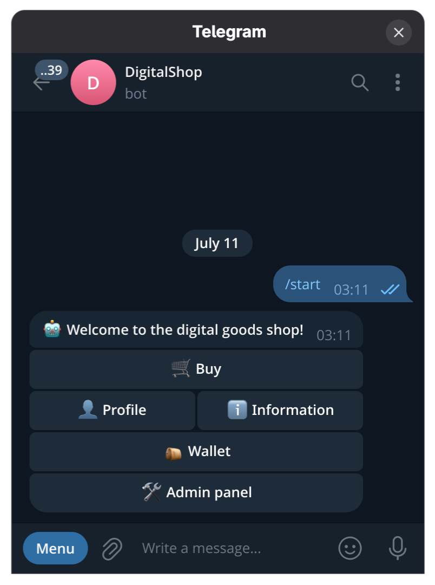

<div align="center">

# 🛒 DigitalShop

**Гибкое решение для запуска магазина цифровых товаров в Telegram**

[](https://python.org)
[](https://postgresql.org)
[](https://redis.io)
[](https://docker.com)
[](LICENSE)
[](https://github.com/astral-sh/ruff)
[](https://github.com/facebook/pyrefly)

[🇷🇺 Русский](README_ru.md) | [🇬🇧 English](../README.md)

</div>

---

## 📋 Содержание

- [О проекте](#-о-проекте)
- [Бизнес-фишки](#-бизнес-фишки)
- [Todo](#-todo)
- [Стек технологий](#-стек-технологий)
- [Установка](#-установка)
- [Запуск](#-запуск)
- [Конфигурация](#-конфигурация)

---

## 💡 О проекте

**DigitalShop** — платформа для продажи цифровых товаров. Поддерживает гибкую иерархию товаров, платёжную систему
Crypto Pay от <a href="https://t.me/send">@CryptoBot</a>, реферальную программу и массовые рассылки. На данный момент
в презентационном слое реализован полноценный Telegram-бот.
<p align="center">
  
</p>

---

## ✨ Бизнес-фишки

<details>
<summary><b>🇷🇺🇬🇧🇺🇦 Мультиязычность и мультивалютность</b></summary>

- **Языки:** русский, английский, украинский
- **Валюты:** USD, RUB, UAH, KZT

</details>

<details>
<summary><b>📦 Гибкое управление товарами</b></summary>

- Трёхуровневая иерархия: **Категория** → **Позиция** → **Товар**
  *(например: 🎮 Аккаунты Steam → Half-Life 2 → ключ активации)*
- Фиксированные товары и исчерпаемые (склад)
- Медиа-вложения к категориям и позициям — до 10 файлов (фото, видео, GIF)

</details>

<details>
<summary><b>👥 Реферальная система</b></summary>

- Вознаграждение в виде настраиваемого процента от суммы заказа реферала

</details>

<details>
<summary><b>🎟️ Купоны</b></summary>

- Применяются на этапе оформления заказа
- Два типа скидки: фиксированная сумма или процент от заказа
- Настраиваемые даты начала и окончания действия

</details>

<details>
<summary><b>💳 Платёжные системы</b></summary>

- Встроенная интеграция с **Crypto Pay**
- Возможность включать и отключать отдельные платёжные системы
- Индивидуальная комиссия для каждой платёжной системы

</details>

<details>
<summary><b>👤 Управление пользователями</b></summary>

Иерархия ролей: **Супер-администратор** → **Администратор** → **Пользователь**. Каждая роль наследует права
нижестоящей (например, `Супер-администратор` может пользоваться всеми правами `Администратора`) и имеет
собственные права.

</details>

<details>
<summary><b>📣 Рассылки</b></summary>

- Рассылки на нескольких языках одновременно
- Добавление URL-кнопок к сообщению
- Уведомления о прогрессе в реальном времени

</details>

> [!NOTE]
> Прочитать подробнее об устройстве бота и бизнес-фишках можно [здесь](features/ru.md)

---

## 📌 Todo

- [ ] Написание unit и integration тестов
- [ ] Настройка CI
- [ ] Обзор архитектурных решений
- [ ] Написание REST API

---

## 🛠 Стек технологий

| Категория                    | Технологии                         |
|-------------------------------|-------------------------------------|
| **Язык / пакетный менеджер**  | Python 3.14, uv                    |
| **Telegram**                   | Aiogram, Aiogram-Dialog            |
| **Web**                        | FastAPI                            |
| **Очереди и планировщик**      | TaskIQ                             |
| **DI / Сериализация**          | Dishka, Adaptix                    |
| **База данных**                | PostgreSQL 18, SQLAlchemy, Alembic |
| **Кэш / Брокер**               | Redis                              |
| **Линтинг**                    | Ruff, Pyrefly                      |
| **Инфраструктура**             | Docker                             |

---

## 📦 Установка

**1. Клонируйте репозиторий:**

```bash
git clone https://github.com/DevNordWind/DigitalShop.git
cd DigitalShop
```

**2. Заполните конфигурационный файл:**

```bash
cp config.yaml.example config.yaml
# Отредактируйте config.yaml под своё окружение
```

**3. Соберите Docker-образы:**

```bash
make build
```

---

## 🚀 Запуск

DigitalShop состоит из нескольких независимых сервисов. Запускайте только те, которые нужны.

### Telegram-бот

```bash
make polling-up   # Polling-режим (рекомендуется для разработки)
make webhook-up   # Webhook-режим (требует заполнения секции webhook в конфиге)
```

### Платёжные вебхуки

```bash
make payment-up   # FastAPI-сервер для получения вебхуков от Crypto Pay
```

### Сервисы TaskIQ

| Entrypoint               | Назначение                                              |
|---------------------------|-----------------------------------------------------------|
| `taskiq.broker`           | Обработка Telegram-рассылок                              |
| `taskiq.priority_broker`  | Уведомления и фоновые задачи (например, отмена заказа)   |
| `taskiq.scheduler`        | Планировщик задач                                        |

---

## ⚙️ Конфигурация

Все настройки хранятся в `config.yaml`. Пример со всеми доступными параметрами — в [`config.yaml.example`](config.yaml.example).

> [!IMPORTANT]
> Перед первым запуском обязательно заполните `config.yaml`. Бот не запустится без корректно заданных токена и
> параметров базы данных.

> [!NOTE]
> Для webhook-режима необходимо дополнительно заполнить секцию `webhook` в конфигурационном файле.

> [!WARNING]
> Это пет-проект, созданный в учебных целях. Я не несу ответственности за любые убытки, потерю данных или иные
> последствия, возникшие в результате использования в продакшен-среде. **Используйте на свой страх и риск.**